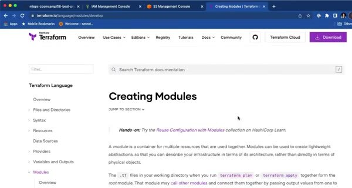
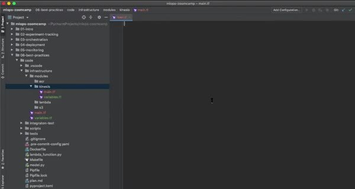

# Terraform: Modules and Output Variables

Terraform modules package reusable infrastructure. A module exposes inputs and outputs while hiding the details of the resources it creates.

## Build a Kinesis module

The course extracts the Kinesis stream resources into a module. The root configuration passes the stream name and other variables to the module. Terraform then uses the output stream identifiers when configuring Lambda and the other resources.

Treat a module as a black box with a documented interface. Variables define what callers can configure. Outputs expose only the values that downstream resources need.

Run `terraform plan` after changing a module and check which resources Terraform will create, update, or destroy. Separate modules make it easier to reuse a component across staging and production without copying its implementation.
