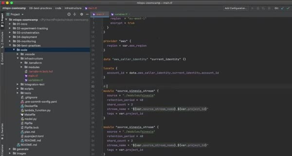
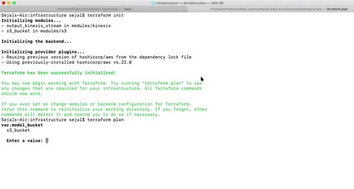

# Build an End-to-end Ride Prediction Workflow

With the reusable Kinesis module in place, add the rest of the ride-prediction infrastructure. Terraform should describe the resources and their connections. Deployment scripts should handle the data and model steps that aren't Terraform resources.

## Add the AWS resources

Store model artifacts in S3 and container images in ECR. Lambda handles prediction, while the pipeline sends input and output events through Kinesis. Terraform connects the relevant component names and ARNs in the root configuration.

Run `terraform init` and `terraform apply` for a staging variable file. After the infrastructure exists, publish the image, copy the model artifact, and set the Lambda environment variables with the deployment scripts.

Keep these stages separate because Terraform owns infrastructure state, while the application deployment owns image tags, model run IDs, and test event data.
