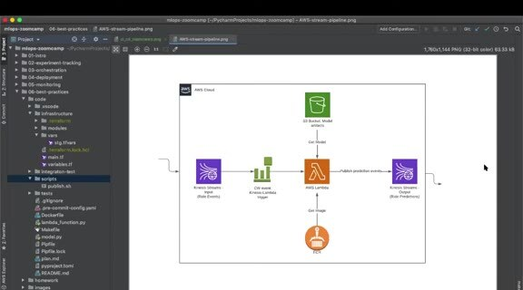
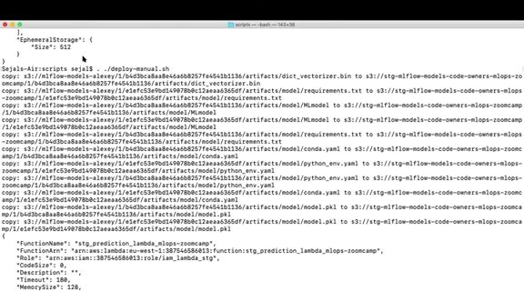

# Test the Pipeline End to End

After Terraform has deployed the resources, test the complete path with one ride event. The event should enter the input Kinesis stream, trigger Lambda, load a model artifact from S3, and produce a record in the output stream.

## Run and review the test

Set the run ID and stream names, insert a known event, and look at the Lambda and CloudWatch output. The test should identify which input produced which prediction and should fail when the response doesn't match the expected structure.

Terraform, the application image, model artifact, and test event are separate dependencies. Record their versions so a failed end-to-end run can be reproduced.
