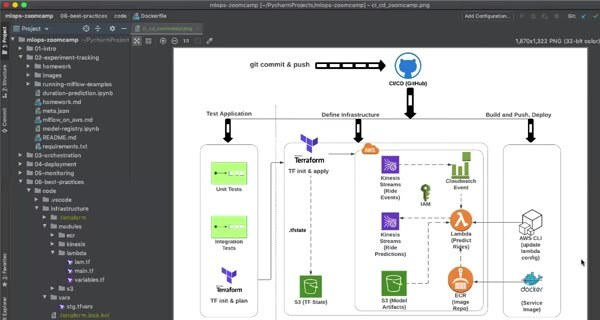

# CI/CD: Introduction

Continuous integration and continuous delivery automate the path from a code change to a tested and deployed service. CI validates a change. CD delivers an approved change to the target environment.

## The workflow design

The course pipeline runs unit tests, integration tests, and a Terraform plan during integration. The delivery workflow applies Terraform, builds and pushes the Docker image to ECR, and updates the Lambda service.

The workflow files live under `.github/workflows/`. Pull requests should run the checks that protect the shared branch. A controlled push or merge can start delivery after CI passes.

