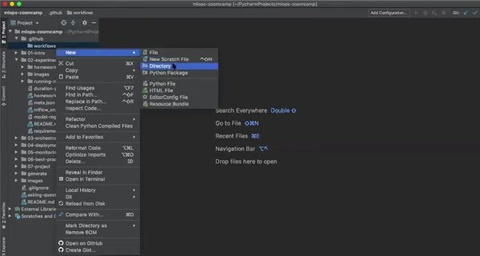
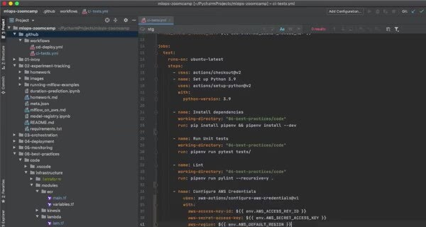

# Continuous Integration

Continuous integration runs the project checks for every proposed change. It should reproduce the local quality gate on a clean GitHub Actions runner.

## Define the CI workflow

Create `.github/workflows/ci-tests.yml` with jobs for environment setup, unit tests, integration tests, and Terraform plan. Trigger it for pull requests to the development branch so reviewers can see the result before merging.

Use the Makefile targets or equivalent commands in the workflow. Keep secrets out of the repository and use a local service such as LocalStack for integration tests that don't need real AWS resources.

A failed check should leave enough logs to identify whether the problem came from Python dependencies, tests, Docker, or Terraform configuration.
