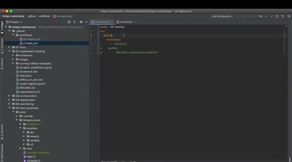
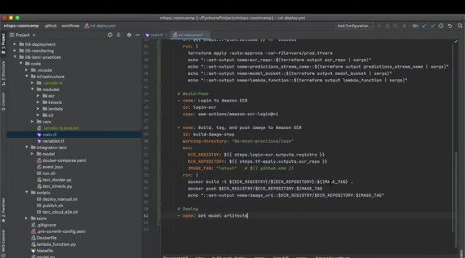

# Continuous Delivery

Continuous delivery takes an integrated change and deploys it to the target environment. The example triggers delivery on a push to the development branch after the CI workflow has validated the code.

## Build the delivery job

Create `.github/workflows/cd-deploy.yml` with Terraform plan/apply, Docker image build, ECR push, and Lambda configuration. The workflow should pass the image tag, model run ID, region, and stream names as explicit environment values.

Separate the CI and CD responsibilities. CI answers whether the change is safe to merge, while CD changes infrastructure and services. Limit CD credentials by requiring the intended branch or approval path.

After deployment, run the end-to-end test from the previous unit and check CloudWatch logs. Keep a rollback plan for both the Lambda image and the Terraform state.
