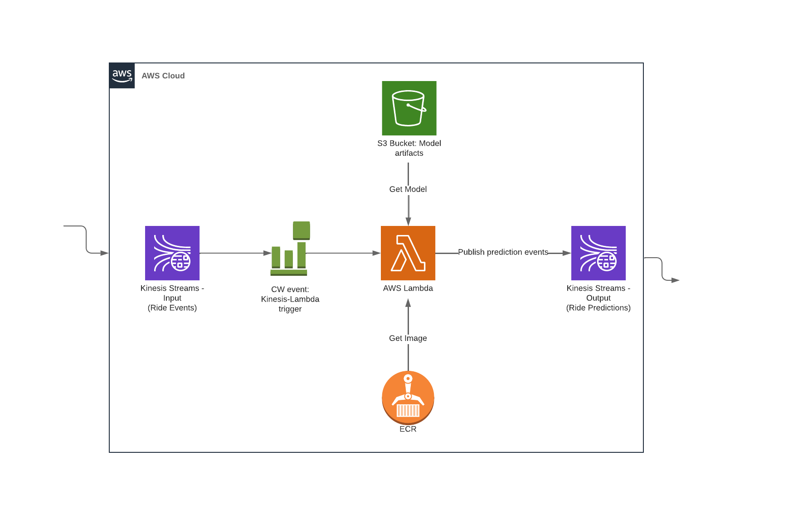

## 06-Best-Practices

### Testing the code:
unit tests with pytest

### Integration tests
with docker-compose

### Testing cloud services
with LocalStack

### Code quality:
- linting and formatting
- Git pre-commit hooks
- Makefiles and make

### Infrastructure as Code

### Project infrastructure modules:
* Amazon Web Service (AWS):
    * Kinesis: Streams (Producer & Consumer)
    * Lambda: Serving API
    * S3 Bucket: Model artifacts
    * ECR: Image Registry
    

#### Part 0. Basics of IaC + TF

1. For an introduction to Terraform and IaC concepts, please refer to this video (from the DE Zoomcamp), especially the sections in the time-codes:
    https://www.youtube.com/watch?v=Hajwnmj0xfQ&list=PL3MmuxUbc_hJed7dXYoJw8DoCuVHhGEQb&index=11
    
    * 00:00 Introduction
    * 00:35 What is Terraform?
    * 01:10 What is IaC?
    * 01:43 Advantages of IaC
    * 14:48 Installing Terraform
    * 02:28 More on Installing Terraform

2. For a quickstart tutorial, and understanding the main components of a basic Terraform script, please refer to this 20-min video (from the DE Zoomcamp). Please note that this example uses GCP as a cloud provider, while for MLOps Zoomcamp we are using AWS.
    https://www.youtube.com/watch?v=dNkEgO-CExg&list=PL3MmuxUbc_hJed7dXYoJw8DoCuVHhGEQb&index=12
    
    * 00:00 Introduction
    * 00:20 .terraform-version
    * 01:04 main.tf
    * 01:23 terraform declaration
    * 03:25 provider plugins
    * 04:00 resource example - google_storage_bucket
    * 05:42 provider credentials
    * 06:34 variables.tf
    * 10:54 overview of terraform commands
    * 13:35 running terraform commands
    * 18:08 recap

#### Part 1. Setting up a stream-based pipeline infrastructure in AWS**

**Setup & Pre-Reqs:**
* Installation material: AWS & TF (refer to previous videos, links in README)
* Pre-Reqs: aws-cli v1, aws secret key pair, terraform client
* Concepts of Terraform and IaC (refer to previous videos, links in README)

**What are Modules and Outputs in Terraform?**
* Build components for ECR, Kinesis, Lambda, S3
* Demo: apply TF to our use-case, manually deploy & test

### CI/CD

**Part 1: CI/CD w/ GitHub Actions**
* What are GitHub workflows?
* `test-pr-pipeline.yml`
    * Copy over sections from tests: Env setup, Unit test, Integration test, Terraform plan
    * Create a develop branch & PR (feature branch) to that
    * Execute demo

* `deploy-pipeline.yml`
    * Copy over sections from tests: Terraform plan, Terraform apply, Docker build & ECR push, Update Lamba config
    * Merge PR to `develop`
    * Execute demo
    
 

**Other material:**

Deploying Serverless Machine Learning with AWS (one of my previous videos explaining Lambda integration with Docker images): https://www.youtube.com/watch?v=79B8AOKkpho&t=689s 
