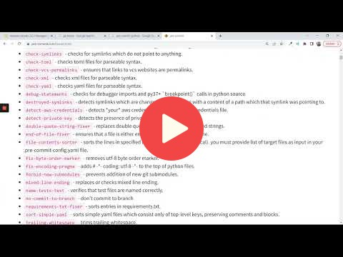

# 6. Best Practices

## 6.1 Testing Python code with pytest

## 6.2 Integration tests with docker-compose

## 6.3 Testing cloud services with LocalStack

## 6.4 Code quality: linting and formatting

## 6.5 Git pre-commit hooks

## 6.6 Makefiles and make

## 6.X Homework

More information here: [homework.md](homework.md)

## Notes

Did you take notes? Add them here:

* Send a PR, add your notes above this line
