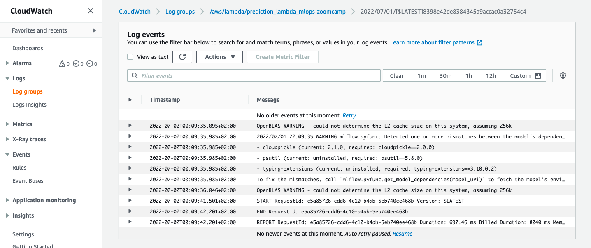

## Code snippets

### Building and running Docker images

```bash
docker build -t stream-model-duration:v2 .
```

```bash
docker run -it --rm \
    -p 8080:8080 \
    -e PREDICTIONS_STREAM_NAME="ride_predictions" \
    -e RUN_ID="e1efc53e9bd149078b0c12aeaa6365df" \
    -e TEST_RUN="True" \
    -e AWS_DEFAULT_REGION="eu-west-1" \
    stream-model-duration:v2
```

Mounting the model folder:

```
docker run -it --rm \
    -p 8080:8080 \
    -e PREDICTIONS_STREAM_NAME="ride_predictions" \
    -e RUN_ID="Test123" \
    -e MODEL_LOCATION="/app/model" \
    -e TEST_RUN="True" \
    -e AWS_DEFAULT_REGION="eu-west-1" \
    -v $(pwd)/model:/app/model \
    stream-model-duration:v2
```

### Specifying endpoint URL

```bash
aws --endpoint-url=http://localhost:4566 \
    kinesis list-streams
```

```bash
aws --endpoint-url=http://localhost:4566 \
    kinesis create-stream \
    --stream-name ride_predictions \
    --shard-count 1
```

```bash
aws  --endpoint-url=http://localhost:4566 \
    kinesis     get-shard-iterator \
    --shard-id ${SHARD} \
    --shard-iterator-type TRIM_HORIZON \
    --stream-name ${PREDICTIONS_STREAM_NAME} \
    --query 'ShardIterator'
```

### Unable to locate credentials

If you get `'Unable to locate credentials'` error, add these
env variables to the `docker-compose.yaml` file:

```yaml
- AWS_ACCESS_KEY_ID=abc
- AWS_SECRET_ACCESS_KEY=xyz
```

### Make

Without make:

```
isort .
black .
pylint --recursive=y .
pytest tests/
```

With make:

```
make quality_checks
make test
```


To prepare the project, run 

```bash
make setup
```

### IaC
w/ Terraform

1. To create infra (manually, in order to test on staging env)
   ```bash
   terraform init
   terraform plan -var-file=vars/stg.tfvars
   terraform apply -var-file=vars/stg.tfvars
   ```

2. To prepare aws env (copy model artifacts, set env-vars for lambda etc.):
    ```
    . ./scripts/deploy_manual.sh
    ```

3. To test the pipeline end-to-end with our new cloud infra:
    ```
    . ./scripts/test_cloud_e2e.sh
    ``` 

4. And then check on CloudWatch logs. Or try `get-records` on the `output_kinesis_stream` (refer to `integration_test`)




### CI/CD

1. Create a PR (feature branch): `.github/workflows/test-pr-pipeline.yml`
    * Env setup, Unit test, Integration test, Terraform plan
2. Merge PR to `develop`: `.github/workflows/deploy-pipeline.yml`
    * Terraform plan, Terraform apply, Docker build & ECR push, Update Lambda config

### Notes

1. Unfortunately, the `RUN_ID` set via the `ENV` or `ARG` in `Dockerfile`, disappears during lambda invocation.
Had to set it via `aws lambda update-function-configuration` cli command (refer to `deploy_manual.sh`)

2. CI/CD
- In principle, explain:
    - generate metrics offline -> set env vars for lambda w/ stage-based deployments
    - train_pipeline -> model registry & update run_id
    - In practice, change in mlflow / db -> get curr run_id
    