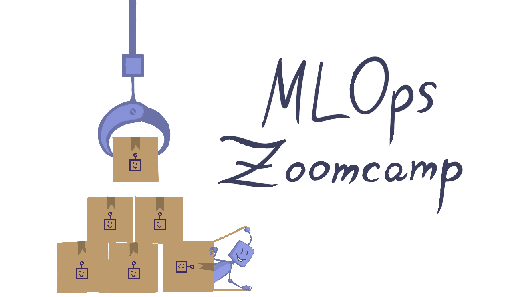
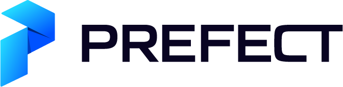

# MLOps Zoomcamp

  

Our MLOps Zoomcamp course

- Sign up here: https://airtable.com/shrCb8y6eTbPKwSTL (it's not automated, you will not receive an email immediately after filling in the form)
- Register in [DataTalks.Club's Slack](https://datatalks.club/slack.html)
- Join the [`#course-mlops-zoomcamp`](https://app.slack.com/client/T01ATQK62F8/C02R98X7DS9) channel
- [Tweet about the course!](https://ctt.ac/fH67W)
- Subscribe to the [public Google calendar](https://calendar.google.com/calendar/?cid=M3Jzbmg0ZDA2aHVsY2M1ZjcyNDJtODNyMTRAZ3JvdXAuY2FsZW5kYXIuZ29vZ2xlLmNvbQ) (subscription works from desktop only)
- Start watching course videos! [Course playlist](https://www.youtube.com/playlist?list=PL3MmuxUbc_hIUISrluw_A7wDSmfOhErJK)
- [Technical FAQ](https://docs.google.com/document/d/12TlBfhIiKtyBv8RnsoJR6F72bkPDGEvPOItJIxaEzE0/edit) 
- [Leaderboard](https://docs.google.com/spreadsheets/d/e/2PACX-1vRhinTR4Gpxcud-xX0cPBVqboO8RE5gFY7W2dfgfhzECuPFOaCoo9TVWUTxxrSmzvbZY0D-N1vai8RN/pubhtml)

## Overview

### Objective

Teach practical aspects of productionizing ML services — from collecting requirements to model deployment and monitoring.

### Target audience

Data scientists and ML engineers. Also software engineers and data engineers interested in learning about putting ML in production.

### Pre-requisites

* Python
* Docker
* Being comfortable with command line 
* Prior exposure to machine learning (at work or from other courses, e.g. from [ML Zoomcamp](https://github.com/alexeygrigorev/mlbookcamp-code/tree/master/course-zoomcamp))
* Prior programming experience (at least 1+ year)

### Timeline

Course start: 16 of May

## Syllabus

This is a draft and will change. 

### [Module 1: Introduction](01-intro)

* What is MLOps
* MLOps maturity model
* Running example: NY Taxi trips dataset
* Why do we need MLOps
* Course overview
* Environment preparation
* Homework

[More details](01-intro)

### [Module 2: Experiment tracking and model management](02-experiment-tracking)

* Experiment tracking intro
* Getting started with MLflow
* Experiment tracking with MLflow
* Saving and loading models with MLflow
* Model registry
* MLflow in practice
* Homework

[More details](02-experiment-tracking)

### Module 3: Orchestration and ML Pipelines

* ML Pipelines: introduction
* Prefect
* Turning a notebook into a pipeline
* Kubeflow Pipelines
* Homework 

### Module 4: Model Deployment 

* Batch vs online
* For online: web services vs streaming
* Serving models in Batch mode
* Web services
* Streaming (Kinesis/SQS + AWS Lambda)
* Homework

### Module 5: Model Monitoring

* ML monitoring vs software monitoring 
* Data quality monitoring
* Data drift / concept drift 
* Batch vs real-time monitoring 
* Tools: Evidently, Prometheus and Grafana
* Homework 

### Module 6: Best Practices

* Devops
* Virtual environments and Docker
* Python: logging, linting
* Testing: unit, integration, regression 
* CI/CD (github actions)
* Infrastructure as code (terraform, cloudformation)
* Cookiecutter
* Makefiles
* Homework

### Module 7: Processes

* CRISP-DM, CRISP-ML
* ML Canvas
* Data Landscape canvas
* [MLOps Stack Canvas](https://miro.com/miroverse/mlops-stack-canvas/)
* Documentation practices in ML projects (Model Cards Toolkit)

### Project

* End-to-end project with all the things above

## Running example

To make it easier to connect different modules together, we’d like to use the same running example throughout the course.

Possible candidates: 

* [https://www1.nyc.gov/site/tlc/about/tlc-trip-record-data.page](https://www1.nyc.gov/site/tlc/about/tlc-trip-record-data.page) - predict the ride duration or if the driver is going to be tipped or not

## Instructors

- Larysa Visengeriyeva
- Cristian Martinez
- Kevin Kho
- Theofilos Papapanagiotou 
- Alexey Grigorev
- Emeli Dral
- Sejal Vaidya

## Other courses from DataTalks.Club:

- [Machine Learning Zoomcamp - free 4-month course about ML Engineering](https://github.com/alexeygrigorev/mlbookcamp-code/tree/master/course-zoomcamp)
- [Data Engineering Zoomcamp - free 9-week course about Data Engineering](https://github.com/DataTalksClub/data-engineering-zoomcamp/)

## FAQ

**I want to start preparing for the course. What can I do?**

If you haven't used Flask or Docker

* Check [Module 5](https://github.com/alexeygrigorev/mlbookcamp-code/tree/master/course-zoomcamp/05-deployment) form ML Zoomcamp
* The [section about Docker](https://github.com/DataTalksClub/data-engineering-zoomcamp/tree/main/week_1_basics_n_setup/2_docker_sql) from Data Engineering Zoomcamp could also be useful

If you have no previous experience with ML

* Check [Module 1](https://github.com/alexeygrigorev/mlbookcamp-code/tree/master/course-zoomcamp/01-intro) from ML Zoomcamp for an overview
* [Module 3](https://github.com/alexeygrigorev/mlbookcamp-code/tree/master/course-zoomcamp/03-classification) will also be helpful if you want to learn Scikit-Learn (we'll use it in this course)
* We'll also use XGBoost. You don't have to know it well, but if you want to learn more about it, refer to [module 6](https://github.com/alexeygrigorev/mlbookcamp-code/tree/master/course-zoomcamp/06-trees) of ML Zoomcamp

**I registered but haven't received an invite link. Is it normal?**

Yes, we haven't automated it. You'll get a mail from us eventually, don't worry.

If you want to make sure you don't miss anything:

* Register in [our Slack](https://datatalks.club/slack.html) and join the `#course-mlops-zoomcamp` channel
* Subscribe to [our YouTube channel](https://youtube.com/c/datatalksclub)

**Is it going to be live?**

No and yes. There will be two parts:

* Lectures: Pre-recorded, you can watch them when it's convenient for you. 
* Office hours: Live on Mondays (17:00 CET), but recorded, so you can watch later.

## Supporters and partners

Thanks to the course sponsors for making it possible to create this course

  

Thanks to our friends for spreading the word about the course

  
  

  

