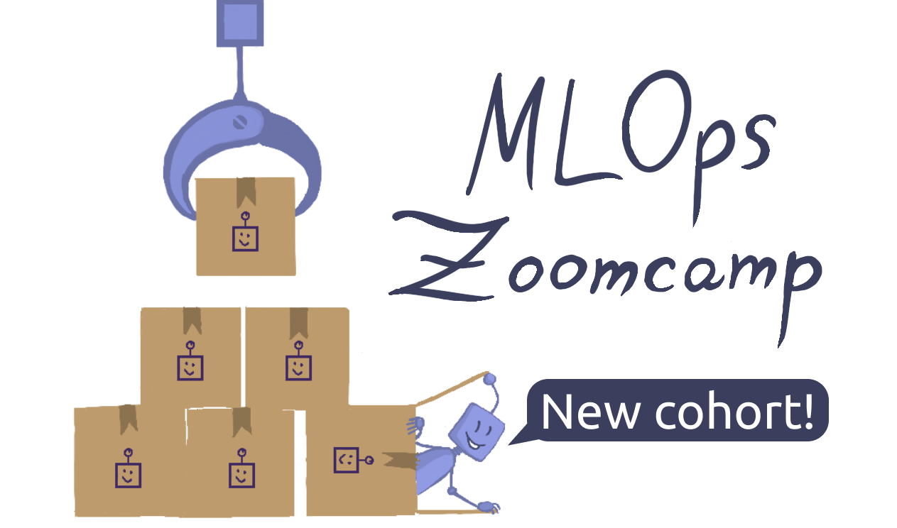

  

<h1 align="center">
    <strong>MLOps Zoomcamp: A Free 9-Week Course on Productionizing ML Services</strong>
</h1>

MLOps (machine learning operations) is becoming a must-know skill for many data professionals. Master the fundamentals of MLOps, from training and experimentation to deployment and monitoring.

<a href="https://datatalks.club/slack.html">Join Slack</a> •
<a href="https://app.slack.com/client/T01ATQK62F8/C01FABYF2RG">#course-mlops-zoomcamp Channel</a> •
<a href="https://t.me/dtc_courses">Telegram Announcements</a> •
<a href="https://www.youtube.com/playlist?list=PL3MmuxUbc_hIUISrluw_A7wDSmfOhErJK">Course Playlist</a> •
<a href="https://docs.google.com/document/d/19bnYs80DwuUimHM65UV3sylsCn2j1vziPOwzBwQrebw/edit?usp=sharing">FAQ</a> •
<a href="https://ctt.ac/fH67W">Tweet about the Course</a>

## How to Take MLOps Zoomcamp

### 2025 Cohort
- **Start Date**: May 2025
- **Register Here**: [Sign up](https://airtable.com/shrCb8y6eTbPKwSTL)
- **Stay Updated**: Subscribe to our [Google Calendar](https://calendar.google.com/calendar/?cid=M3Jzbmg0ZDA2aHVsY2M1ZjcyNDJtODNyMTRAZ3JvdXAuY2FsZW5kYXIuZ29vZ2xlLmNvbQ) (Desktop only)

### Self-Paced Learning
All course materials are freely available for independent study. Follow these steps:
1. Watch the course videos.
2. Join the [Slack community](https://datatalks.club/slack.html).
3. Refer to the [FAQ document](https://docs.google.com/document/d/12TlBfhIiKtyBv8RnsoJR6F72bkPDGEvPOItJIxaEzE0/edit) for guidance.

## Syllabus
The course consists of structured modules, hands-on workshops, and a final project to reinforce your learning. Each module introduces core MLOps concepts and tools.

### Prerequisites
To get the most out of this course, you should have prior experience with:
- Python
- Docker
- Command line basics
- Machine learning (e.g., through [ML Zoomcamp](https://github.com/alexeygrigorev/mlbookcamp-code/tree/master/course-zoomcamp))
- 1+ year of programming experience

### Modules

#### [Module 1: Introduction](01-intro)
- What is MLOps?
- MLOps maturity model
- NY Taxi dataset (our running example)
- Why MLOps is essential
- Course structure & environment setup
- Homework

#### [Module 2: Experiment Tracking & Model Management](02-experiment-tracking)
- Introduction to experiment tracking
- MLflow basics
- Model saving and loading
- Model registry
- Hands-on MLflow exercises
- Homework

#### [Module 3: Orchestration & ML Pipelines](03-orchestration)
- Workflow orchestration
- Using Mage for ML pipelines
- Homework

#### [Module 4: Model Deployment](04-deployment)
- Deployment strategies: online (web, streaming) vs. offline (batch)
- Deploying with Flask (web service)
- Streaming deployment with AWS Kinesis & Lambda
- Batch scoring for offline processing
- Homework

#### [Module 5: Model Monitoring](05-monitoring)
- Monitoring ML-based services
- Web service monitoring with Prometheus, Evidently, and Grafana
- Batch job monitoring with Prefect, MongoDB, and Evidently
- Homework

#### [Module 6: Best Practices](06-best-practices)
- Unit and integration testing
- Linting, formatting, and pre-commit hooks
- CI/CD with GitHub Actions
- Infrastructure as Code (Terraform)
- Homework

#### [Final Project](07-project/)
- End-to-end project integrating all course concepts

## Community & Support

### **Getting Help on Slack**
Join the [`#course-mlops-zoomcamp`](https://app.slack.com/client/T01ATQK62F8/C02R98X7DS9) channel on [DataTalks.Club Slack](https://datatalks.club/slack.html) for discussions, troubleshooting, and networking.

To keep discussions organized:
- Follow [our guidelines](asking-questions.md) when posting questions.
- Review the [community guidelines](https://datatalks.club/slack/guidelines.html).

## Meet the Instructors
- **Cristian Martinez**
- **Tommy Dang**
- **Alexey Grigorev**
- **Emeli Dral**
- **Sejal Vaidya**

## Other Free Courses from DataTalks.Club
- [Machine Learning Zoomcamp](http://mlzoomcamp.com) – 4-month ML Engineering course
- [Data Engineering Zoomcamp](https://github.com/DataTalksClub/data-engineering-zoomcamp/) – 9-week Data Engineering course
- [LLM Zoomcamp](https://github.com/DataTalksClub/llm-zoomcamp)
- [Stock Market Analytics Zoomcamp](https://github.com/DataTalksClub/stock-markets-analytics-zoomcamp)

## FAQ

**How can I prepare for the course?**
- If you’re new to **Flask** or **Docker**, check out:
  - [ML Zoomcamp: Module 5](https://github.com/alexeygrigorev/mlbookcamp-code/tree/master/course-zoomcamp/05-deployment)
  - [Docker section](https://github.com/DataTalksClub/data-engineering-zoomcamp/tree/main/01-docker-terraform/2_docker_sql) from Data Engineering Zoomcamp
- If you’re new to **machine learning**, start with:
  - [ML Zoomcamp: Module 1](https://github.com/alexeygrigorev/mlbookcamp-code/tree/master/course-zoomcamp/01-intro) for an overview
  - [Module 3](https://github.com/alexeygrigorev/mlbookcamp-code/tree/master/course-zoomcamp/03-classification) for Scikit-Learn basics (used in this course)
  - [Module 6](https://github.com/alexeygrigorev/mlbookcamp-code/tree/master/course-zoomcamp/06-trees) for XGBoost (optional but helpful)

**I registered but didn’t receive an invite. Is this normal?**
Yes, invites aren’t automated. You’ll receive an email eventually.

To stay updated:
- Join the `#course-mlops-zoomcamp` channel on [Slack](https://datatalks.club/slack.html)
- Subscribe to our [YouTube channel](https://youtube.com/c/datatalksclub)

## Sponsors & Supporters
A special thanks to our course sponsors for making this initiative possible!

  

Interested in supporting our community? Reach out to [alexey@datatalks.club](mailto:alexey@datatalks.club).

## About DataTalks.Club

  

<a href="https://datatalks.club/">DataTalks.Club</a> is a global online community of data enthusiasts. It's a place to discuss data, learn, share knowledge, ask and answer questions, and support each other.

<a href="https://datatalks.club/">Website</a> •
<a href="https://datatalks.club/slack.html">Join Slack Community</a> •
<a href="https://us19.campaign-archive.com/home/?u=0d7822ab98152f5afc118c176&id=97178021aa">Newsletter</a> •
<a href="http://lu.ma/dtc-events">Upcoming Events</a> •
<a href="https://calendar.google.com/calendar/?cid=ZjhxaWRqbnEwamhzY3A4ODA5azFlZ2hzNjBAZ3JvdXAuY2FsZW5kYXIuZ29vZ2xlLmNvbQ">Google Calendar</a> •
<a href="https://www.youtube.com/@DataTalksClub/featured">YouTube</a> •
<a href="https://github.com/DataTalksClub">GitHub</a> •
<a href="https://www.linkedin.com/company/datatalks-club/">LinkedIn</a> •
<a href="https://twitter.com/DataTalksClub">Twitter</a>

All the activity at DataTalks.Club mainly happens on [Slack](https://datatalks.club/slack.html). We post updates there and discuss different aspects of data, career questions, and more.

At DataTalksClub, we organize online events, community activities, and free courses. You can learn more about what we do at [DataTalksClub Community Navigation](https://www.notion.so/DataTalksClub-Community-Navigation-bf070ad27ba44bf6bbc9222082f0e5a8?pvs=21).
