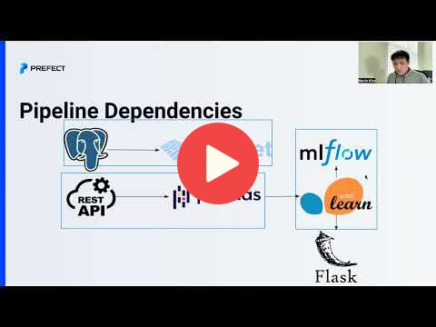
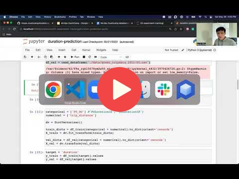
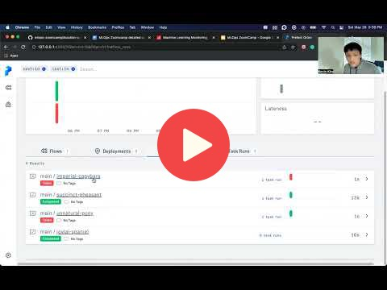
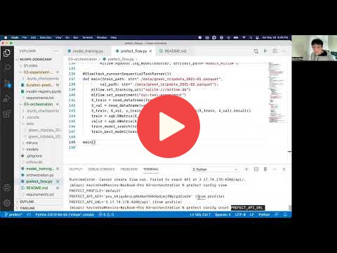
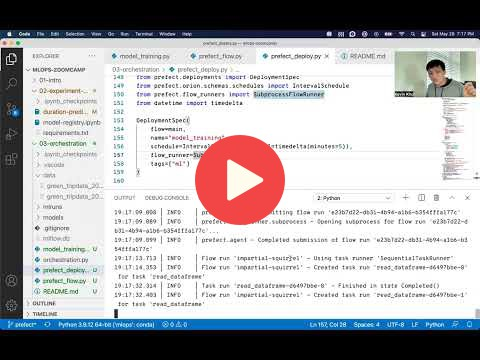

# 3. Orchestration and ML Pipelines

**Note:** [`orchestration.py`](orchestration.py) is a ready final version. The rest of the files were worked on together during the video tutorials.

**Note** With Prefect version [`2.2.1`](https://github.com/PrefectHQ/prefect/blob/orion/RELEASE-NOTES.md#20b8) or later `DeploymentSpec`'s are now just `Deployment`'s.

## 3.1 Negative engineering and workflow orchestration

<a href="https://www.youtube.com/watch?v=eKzCjNXoCTc&list=PL3MmuxUbc_hIUISrluw_A7wDSmfOhErJK">
  
</a>


## 3.2 Introduction to Prefect 2.0

<a href="https://www.youtube.com/watch?v=Yb6NJwI7bXw&list=PL3MmuxUbc_hIUISrluw_A7wDSmfOhErJK">
  
</a>


## 3.3 First Prefect flow and basics

<a href="https://www.youtube.com/watch?v=MCFpURG506w&list=PL3MmuxUbc_hIUISrluw_A7wDSmfOhErJK">
  
</a>


## 3.4 Remote Prefect Orion deployment

<a href="https://www.youtube.com/watch?v=ComkSIAB0k4&list=PL3MmuxUbc_hIUISrluw_A7wDSmfOhErJK">
  
</a>


## 3.5 Deployment of Prefect flow

**Note:** There are several changes to deployment in Prefect 2.3.1 since 2.0b8:
- `DeploymentSpec` in 2.0b8 now becomes `Deployment`. 
- `work_queue_name` is used instead of `tags` to submit the deployment to the a specific work queue. 
- You don't need to create a work queue before using the work queue. A work queue will be created if it doesn't exist. 

```python
from prefect.deployments import Deployment
from prefect.orion.schemas.schedules import IntervalSchedule
from datetime import timedelta

deployment = Deployment.build_from_flow(
    flow=main,
    name="model_training",
    schedule=IntervalSchedule(interval=timedelta(minutes=5)),
    work_queue_name="ml"
)

deployment.apply()
```

<a href="https://www.youtube.com/watch?v=xw9JfaWPPps&list=PL3MmuxUbc_hIUISrluw_A7wDSmfOhErJK">
  
</a>

Links:

* [Instructions for Hosting Prefect Orion](https://discourse.prefect.io/t/hosting-an-orion-instance-on-a-cloud-vm/967)


## 3.6 MLOps Zoomcamp 3.6 - (Optional) Work queues and agents

<a href="https://www.youtube.com/watch?v=oDSf0ThKsso&list=PL3MmuxUbc_hIUISrluw_A7wDSmfOhErJK">
  
</a>


## 3.7 Homework

More information here: TBD


## Notes

Did you take notes? Add them here:

* [Week 3, Prefect Introduction and S3 Bucket configuration with Prefect by M. Ayoub C.](https://gist.github.com/Qfl3x/8dd69b8173f027b9468016c118f3b6a5)
* [Notes from froukje](https://github.com/froukje/ml-ops-zoomcamp/blob/master/03-orchestration/week03_orchestration.ipynb)
* [Minimalist code notes from Anna V](https://github.com/annnvv/mlops_zoomcamp/blob/main/notes/module3_notes_prefect.md)
* [Getting Started on Prefect 2.0 + Deploying worfklows for MLflow Staging by Ron Medina (Jupyter Book)](https://particle1331.github.io/inefficient-networks/notebooks/mlops/3-prefect/3-prefect.html)
* [Quickstart your homework by Zioalex](https://github.com/zioalex/mlops-zoomcamp/blob/week3/03-orchestration/homework_quickstart.md)
* [Notes from Maxime M](https://github.com/maxmarkov/mlops-zoomcamp/blob/master/lecture-notes/WEEK-3/03-orchestration.md)
* [Week3: Prefect introduction and homework notes by Bhagabat](https://github.com/BPrasad123/MLOps_Zoomcamp/tree/main/Week3)
* [Week 3: Orchestration notes by Ayoub.B](https://github.com/ayoub-berdeddouch/mlops-journey/blob/main/orchestration-03.md)
* Send a PR, add your notes above this line
