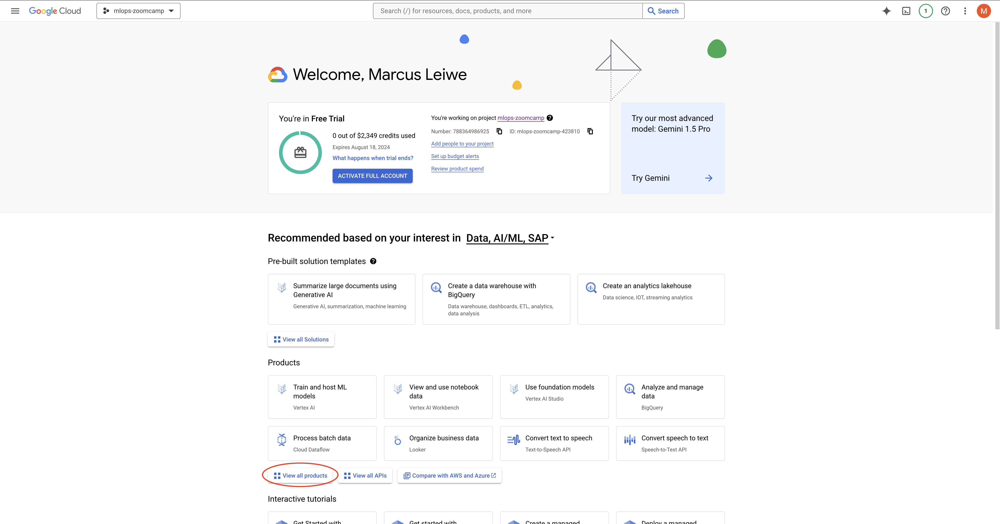
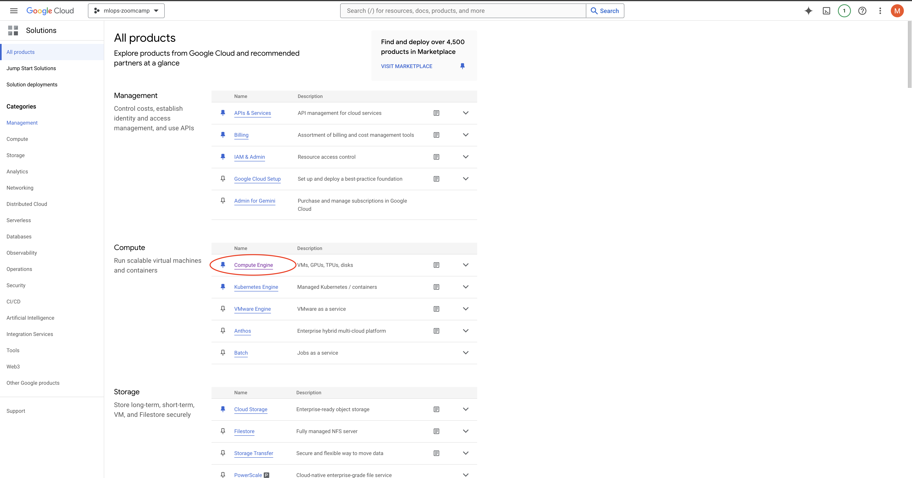
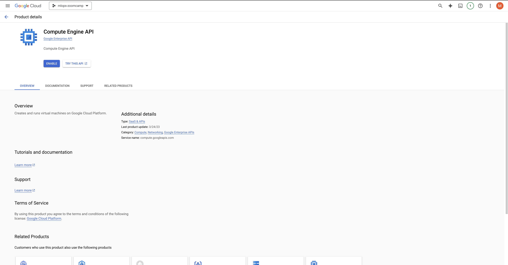
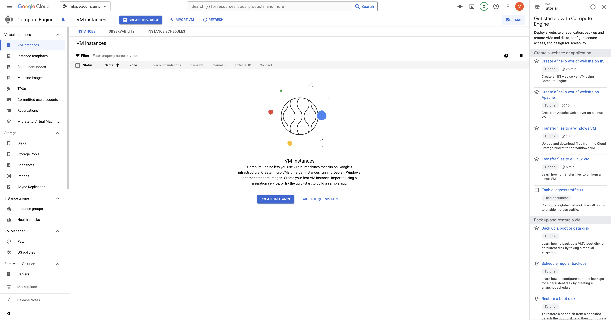
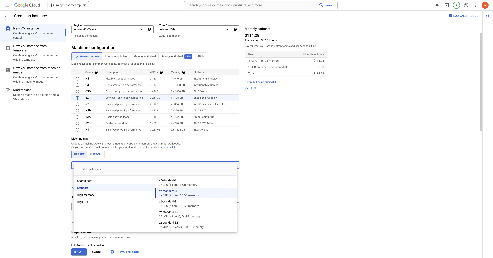
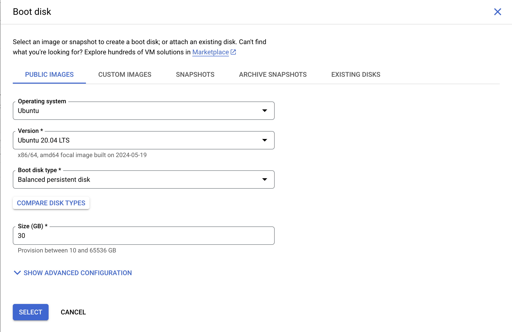
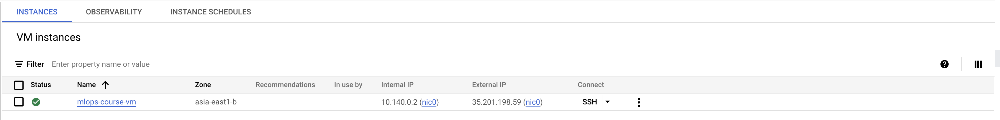
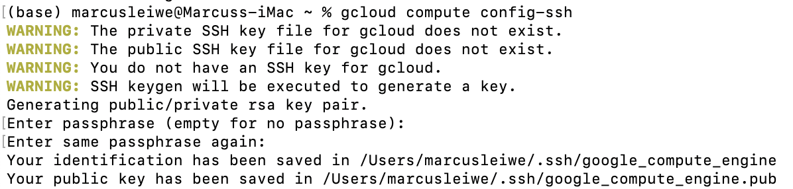
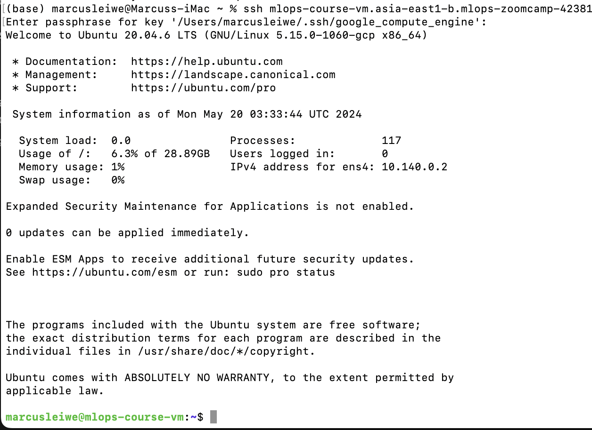

# Setting up Google Cloud Platform on your MacOS
Credits: 
* These notes are modified from [Alvaro Navas's](https://gist.github.com/ziritrion) notes on [Environment Set up in GCP](https://gist.github.com/ziritrion/3214aa570e15ae09bf72c4587cb9d686).
* I also found this [youtube video](https://www.youtube.com/watch?v=3wPl-AnegI4) helpful, it has someone going through this in realtime. The order is a little different to these notes. But the initial set up is the same upto ~2:37.

All that I've done is add in some screenshots for MacOS and tried to spend a bit of time on explaining things that I didn't understand being completely new to cloud computing.

## Install and setup Gcloud SDK
### 1. Download Gcloud SDK from [this link](https://cloud.google.com/sdk/docs/install) and install it according to the instructions for your OS.
* NB I gunzipped it 

* Then had to double click the .tar file in order to create the folder `google-cloud-sdk`


### 2. Initialize the SDK following [these instructions](https://cloud.google.com/sdk/docs/quickstart).

*Before you do this make sure you create a GoogleCloud account. NB This is not the same as Colab etc. There are links in the guide above, and as of writing this there is still $300 USD worth of credits for free.*

i. In your terminal navigate to the `google-cloud-sdk` and type `install.sh` to begin this process.

ii. `Do you want to help improve the Google Cloud CLI (y/N)?` --> I chose y but it doesn't matter.

iii. `Modify profile to update your $PATH and enable shell command completion?... Do you want to continue (Y/n)?` --->y, this way you don't always need to enter the relevant path.

iv. `Enter a path to an rc file to update, or leave blank to use [/Users/marcusleiwe/.zshrc]:` --> left blank.

v. `Google Cloud CLI works best with Python 3.11 and certain modules. Download and run Python 3.11 installer? (Y/n)?` --> I picked no because I already have 3.11.7.
You can see what version you have by typing `python -V` into your terminal command line (see the screenshot below)


vi. Reload the .zshrc file to make sure you're in the right place. By typing the command out below

    `source ~/.zshrc`

vii. type `gclou` and press tab. If it auto-completes to `gcloud` then you should have gcloud on your system.

viii. Run `gcloud init` from a terminal and follow the instructions.

* There's a login section, where it will launch a page and allow you to login to the google account associated with your cloud account. (NB This is the part which Tony forogt initially in the video)

* Then select the project you want to run or create a new project (in this case I picked mlops-zoomcamp which I created beforehand)


ix. Make sure that your project is selected with the command `gcloud config list`.
This should produce the following inputs

    [core]
    account = xxxxxxxx@gmail.com #Your e-mail should go here
    disable_usage_reporting = False
    project = mlops-zoomcamp-423810

    Your active configuration is: [default]


## Creating a VM instance
From the project dashboard, we need to create a virtual instance. If it is not visible as a card in the products section click on the `view all products` button (see screenshot).


From here, select compute engine to set it up


If not already installed you may need to enable the `Compute Engine API` (see screenshot).


From here it should navigate you to the VM instances page, from here we can create our VM instance. (click on the Create Instance button in the main pane)


### VM configs for MLops course
This should take you to the config settings for your VN. I will be following Alvaro's suggestions and also following the suggestions from Alexy on how he set up his EC2 instance in AWS.

#### Manual Installation (recommended if you want to learn about the set up)

* Name: `mlops-course-vm` 
You can choose anything, but pick something that isn't too long to type

* Region: `asia-east1`
There are lots of options here, and you can check them out on the link [here](https://cloud.google.com/about/locations). I'm based in Hong Kong at the moment so I've picked Taiwan (asia-east1) because it offers more services than the current Hong Kong region while still minimising the latencies. 
Helpful links to make your decision
    * [What to look for when choosing your region](https://cloud.google.com/solutions/best-practices-compute-engine-region-selection). 
    * [Regions Pricings](https://cloud.google.com/skus/?currency=USD&hl=en&filter=asia-east)

* Zone: `asia-east-1b`
From what I understand in general it is helpful to try and store all the data within the same zone as it is faster and potentially cheaper. Once again there is a helpful google guide [here](https://cloud.google.com/compute/docs/regions-zones) to explain the differences between regions, zones, and clusters.

* Machine Configuration: `E2 series instance`
 

A e2-standard-4 instance is recommended (4 vCPUs, 16GB RAM). To do this select
* General purpose: `E2`
    * Machine Type: `e2-standard-4 (4vCPU, 2 core, 16GB memory)`  NB this is not the default option, in the screenshot above it will show you how to roughly navigate to selecting the option.
        * vCPUs to core ration and visible core count left blank
    
* Availability policies: `Standard` 
There is also the [Spot](https://cloud.google.com/compute/docs/instances/spot) option. Essentially, this is cheaper but uses spare capacity, so your processes could terminate at any given time. For safety's sake I've stuck to standard, but seeing as this is just a training course I probably could get away with running spot instances.

* Display device: Not selected

* Boot disk: Recommended to change to `Ubuntu 20.04 LTS`, and pick at least `30GB` of storage.


* Leave all other settings on their default values and click `create`
 
 You should then be directed back to the VM Instances page and you should see the instance is running

NB when you are finished remember to switch it off. Otherwise you will pay for it.
#### CLI based Installation
This is much easier. Just type the following instructions

    gcloud compute instances create mlops-course-vm --zone=asia-east1b --image-family=ubuntu-2004-lts --image-project=ubuntu-os-cloud --machine-type=e2-standard-4 --boot-disk-size=30GB

When you create an instance, it will be started automatically. You can skip to step 3 of the next section.

## Set up SSH access
1. Start your instance from the VM instances dashboard.
2. In your local terminal, make sure that gcloud SDK is configured for your project. Use `gcloud config list` to list your current config's details.
    The output should be the same as your initialisation

        [core]
        account = xxxxxxxx@gmail.com #Your e-mail should go here
        disable_usage_reporting = False
        project = mlops-zoomcamp-423810

        Your active configuration is: [default]

    Troubleshooting...

    **If you have multiple google accounts but the current config does not match the account you want:**        
    
    i. Use `gcloud config configurations list` to see all of the available configs and their associated accounts.

    ii. Change to the config you want with `gcloud config configurations activate my-project` --> In this case it would be `gcloud config configurations activate mlops-course-vm`.

    **If the config matches your account but points to a different project:**
    
    i. Use `gcloud projects list` to list the projects available to your account (it can take a while to load).

    ii. Use `gcloud config set project my-project` to change your current config to your project. --> In this case it would be `gcloud config set project mlops-course-vm`.

3. Set up the SSH connection to your VM instances with `gcloud compute config-ssh`.
    * Inside ~/ssh/ a new config file should appear with the necessary info to connect.
    * If you did not have a SSH key, a pair of public and private SSH keys will be generated for you. 
    After the fingerprint and random art you should receive this
        Updating project ssh metadata...⠹Updated [https://www.googleapis.com/compute/v1/projects/mlops-zoomcamp-423810].                                                             
        Updating project ssh metadata...done.                                                                                                                                        
        You should now be able to use ssh/scp with your instances.
        For example, try running:

        $ ssh mlops-course-vm.asia-east1-b.mlops-zoomcamp-xxxxx

    * The output of this command will give you the host name of your instance in this format: instance.zone.project ; write it down. NB You can [find it out](https://cloud.google.com/compute/docs/samples/compute-instances-get-hostname#compute_instances_get_hostname-python) if you forget but it seems like a lot of hassle.

4. You should now be able to open a terminal and SSH to your VM instance like this:

    ```ssh instance.zone.project```

    I received a warning stating

    ```
    The authenticity of host 'compute.xxxxxxxxx (xx.xxx.xxx.xx)' can't be established.
    ED25519 key fingerprint is SHA256:xxxxxxx.
    This key is not known by any other names
    Are you sure you want to continue connecting (yes/no/[fingerprint])?
    ```
    Here I typed in the fingerprint obtained from above. It will close the connection and you will have to restart.
    Type `gcloud compute config-ssh`
    You will then be prompted to enter your passphrase and once done you're in!
    


5. In VSCode, with the Remote SSH extension, if you run the command palette and look for Remote-SSH: Connect to Host (or alternatively you click on the Remote SSH icon on the bottom left corner and click on Connect to Host), your instance should now be listed. Select it to connect to it and work remotely.
(Optional) Starting your instance with gcloud sdk after you shut it down.
List your available instances.
gcloud compute instances list
Start your instance.
gcloud compute instances start <instance_name>
Set up ssh so that you don't have to manually change the IP in your config files.
gcloud compute config-ssh
Install stuff
Run this first in your SSH session: sudo apt update && sudo apt -y upgrade
It's a good idea to run this command often, once per day or every few days, to keep your VM up to date.
Anaconda:
In your local browser, go to the Anaconda download page, scroll to the bottom, right click on the 64 bit x86 installer link under Linux and copy the URL.
At the time of writing this gist, the URL is https://repo.anaconda.com/archive/Anaconda3-2021.11-Linux-x86_64.sh
In your SSH session, type wget <anaconda_url> to download the installer.
Find the filename of the installer with ls
Run the installer with bash <filename> (you can start typing the name and then press the Tab key to autocomplete)
Follow the on-screen instructions. Anwer yes to all yes/no questions and leave all other default values.
Log out of your current SSH session with exit and log back in. You should now see a (base) at the beginning of your command prompt.
You may now remove the Anaconda installer with rm <filename>
Docker:
Run sudo apt install docker.io to install it.
Change your settings so that you can run Docker without sudo:
Run sudo groupadd docker
Run sudo gpasswd -a $USER docker
Log out of your SSH session and log back in.
Run sudo service docker restart
Test that Docker can run successfully with docker run hello-world
Docker compose:
Go to https://github.com/docker/compose/releases and copy the URL for the docker-compose-linux-x86_64 binary for its latest version.
At the time of writing, the last available version is v2.2.3 and the URL for it is https://github.com/docker/compose/releases/download/v2.2.3/docker-compose-linux-x86_64
Create a folder for binary files for your Linux user:
Create a subfolder bin in your home account with mkdir ~/bin
Go to the folder with cd ~/bin
Download the binary file with wget <compose_url> -O docker-compose
If you forget to add the -O option, you can rename the file with mv <long_filename> docker-compose
Make sure that the docker-compose file is in the folder with ls
Make the binary executable with chmod +x docker-compose
Check the file with ls again; it should now be colored green. You should now be able to run it with ./docker-compose version
Go back to the home folder with cd ~
Run nano .bashrc to modify your path environment variable:
Scroll to the end of the file
Add this line at the end:
export PATH="${HOME}/bin:${PATH}"
Press CTRL + o in your keyboard and press Enter afterwards to save the file.
Press CTRL + x in your keyboard to exit the Nano editor.
Reload the path environment variable with source .bashrc
You should now be able to run Docker compose from anywhere; test it with docker-compose version
Terraform:
Run curl -fsSL https://apt.releases.hashicorp.com/gpg | sudo apt-key add -
Run sudo apt-add-repository "deb [arch=amd64] https://apt.releases.hashicorp.com $(lsb_release -cs) main"
Run sudo apt-get update && sudo apt-get install terraform
Upload/download files to/from your instance
Download a file.

# From your local machine
scp <instance_name>:path/to/remote/file path/to/local/file
Upload a file.

# From your local machine
scp path/to/local/file <instance_name>:path/to/remote/file
You can also drag & drop stuff in VSCode with the remote extension.

If you use a client like Cyberduck, you can connect with SFTP to your instance using the instance.zone.project name as server, and adding the generated private ssh key.