# MLOps Zoomcamp Ch3 Orchestration
[Chapter 3](https://github.com/mleiwe/mlops-zoomcamp/tree/main/03-orchestration) of the 2024 MLOps Zoomcamp.

Orchestration is essentially the organising and management of a pipeline that develops, deploys, and maintains a machine learning solution. A pretty good summary can be seen in this [medium article](https://towardsdatascience.com/machine-learning-orchestration-vs-mlops-d4cfe3b7bec) although their focus is more on Airflow than Mage which is what this course covers

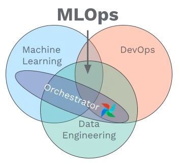

Image created by [Jeff Fletcher](https://towardsdatascience.com/machine-learning-orchestration-vs-mlops-d4cfe3b7bec)

In order to build an efficient and reliable pipeline/workflow, one must have structured/organised thoughts and plans that are well documented and factor in use cases. So for this aspect of the course we have to work in a structured manner.

## 3.0 Introduction ML pipelines and Mage
### What is MLOps?
MLOps is essentially moving ML models from deployment and into production in order to drive business value.

There are several steps to this
1. **Preparing the model for deployment**
This involves optimizing performance, ensuring it handles real-world data, and packaging it for integration into existing systems.
2. **Deploying the model**
This involves moving it from development to production, making it accessible to users and applications.
3. **Monitoring the model**
Once deployed, models must be continuously monitored for accuracy and reliability, and may need retraining on new data and updates to maintain effectiveness.
4. **Integrate the model into existing workflows**
The operationalized model must be integrated into existing workflows, applications, and decision-making processes to drive business impact.
*"Effective operationalization enables organizations to move beyond experimentation and drive tangible value from ML at scale, powering intelligent applications that personalize the customer experience and creates real business value."*

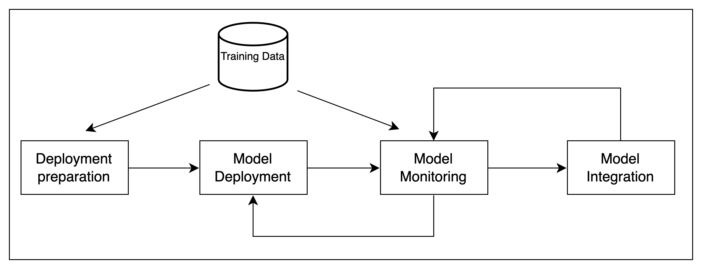
*NB This is a simplistic version that will get updated as the course goes on.*

### Why do we need to operationalise ML?
**MLOps increases productivity**
MLOps helps data scientists, ML engineers, and DevOps specialists work effectively with each other. This is done by **providing/creating a unified environment** for features such as: experiment tracking, feature engineering, model management, and deployment. 

The end result is that cross-functional teams are able to work together throughout the entire machine learning lifecycle.

**MLOps ensures reliability**
By creating a standard workflow/pipeline MLOps ensures high quality reliable models. This is **achieved through clean datasets, proper testing, validation, CI/CD practices, monitoring, and governance**.

**MLOps ensures reproducibility**
The standard workflow/pipeline that MLOps produces should also produce reliable results and ensure compliance. This is **achieved by versioning datasets, codes, and models**. This helps with transparency and auditability to ensure adherence to policies and regulations.

**Time-to-value**
This standard pipeline streamlines the ML lifecycle, enabling organisations to successfully deploy more projects to production and derive tangible business value and ROI from AI/ML investments at scale.

### Why Mage?
There are other management solutions out there which are nicely summarised in this [blog post](https://neptune.ai/blog/mlops-tools-platforms-landscape) (Honestly well worth a careful read). In practice your decisions will be based on your situation in terms of cloud infrastructure, etc.

**So what does Mage offer?**

**1. Data Preparation**
Mage offers features to build, run, and manage data pipelines for data transformation and integration, including pipeline orchestration, notebook environments, data integrations, and streaming pipelines for real-time data.

**2. Training and Deployment**
Mage provides accessible API endpoints to help prepare data, train and deploy ML models

**3. Standardise Complex Processes**
Mage provides a uniform platform for data pipelining, model development, deployment, versioning, CI/CD, and maintainece. This allows developers to focus on model creation while improving efficiency and collaboration.

### Mage example pipeline
There is the following [quickstart guide](https://github.com/mleiwe/mlops-zoomcamp/blob/main/03-orchestration/README.md#Quickstart) or just follow the instructions below.

#### Set up the pipeline
1. Git Clone the repo
```
$git clone https://github.com/mage-ai/mlops.git
```

2. Change directory to the cloned repo
You should be able to cd to`mlops` as the repo should have been cloned into your current directory. If not you just need to navigate to that folder.
```
$cd mlops
```
3. Launch Mage and the database service (PostgreSQL)
```
$./scripts/start.sh
```
NB A warning may appear `WARN[0000] The "PYTHONPATH" variable is not set. Defaulting to a blank string.`. I'm guessing we don't need to worry about this.

You do however need to make sure the docker daemon is running. (In plain English make sure your docker app is running)

4. The subproject that contains all the pipelines and code is named [`unit_3_observability`](https://github.com/mage-ai/mlops/tree/master/mlops/unit_3_observability)

#### Running the pipeline
1. Open [`http://localhost:6789`](http://localhost:6789) into your browser. This will launch the Mage UI
2. Select the `unit_0_setup` option from the available projects.
3. Navigate to the pipeline option (2nd option on the left hand side) and select the pipeline names `example pipeline`.
4. Click on the button labelled `Run @once`. This will run the pipeline.


Once the run is complete (should take <1 minute) you can then  view the log, and further details for that run of the pipeline.
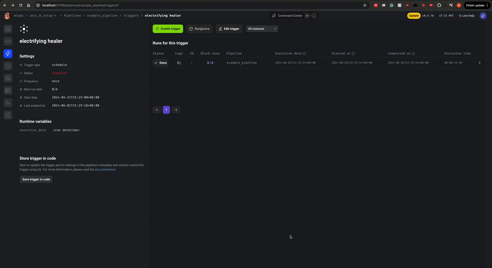

NB a file titled `titanic_clean.csv` should have appeared in your `mlops` folder.

### Useful Resources
1. [Code for the example data pipeline](https://github.com/mage-ai/mlops/tree/master/mlops/unit_0_setup)
2. [The definitive end to end machine learning ML lifecycle guide and tutorial for data engineers](https://mageai.notion.site/The-definitive-end-to-end-machine-learning-ML-lifecycle-guide-and-tutorial-for-data-engineers-ea24db5e562044c29d7227a67e70fd56?pvs=4)
3. [Quickstart Guide](https://github.com/mleiwe/mlops-zoomcamp/blob/main/03-orchestration/README.md#Quickstart)
4. [Platform landscape for MLOps tools](https://neptune.ai/blog/mlops-tools-platforms-landscape)
5. [What is MLOps Orchestration](https://towardsdatascience.com/machine-learning-orchestration-vs-mlops-d4cfe3b7bec)

## 3.1 Data Preparation: ETL and Feature Engineering
### 3.1.1 Data Preparation: New Project
#### 3.1.1.1 Create the new project
1. Open up the text editor. This can be found in the `command center`, which can be accessed at the top of the browser pane, or by the shortcut `cmd/cntrl + .` then searching for text editor.


2. Then create a New Mage Project. This is done by selecting the ribbon, going to the main project folder (In this case "mlops" and then right clicking). 

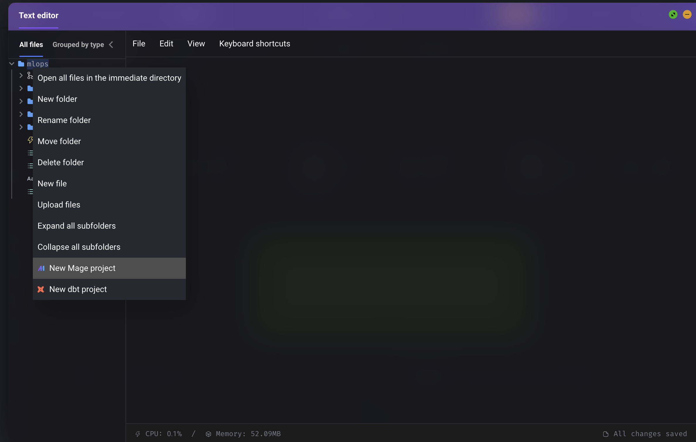

3. A modal will then pop up asking you to name the project. As this is the first part of the pipeline, I will call this `unit_1_data_preparation`.

#### 3.1.1.2 Register the new project
1. The next step is to register the new project so. Exit the text editor.
2. Then go to settings (bottom icon, left hand side ribbon) and then settings again. And on the top left of the projects pane there should be the button `+ Register Project` (Circled in red on the screen shot below). Once registered you can scroll down and save settings. Your project should now be ready to work on.

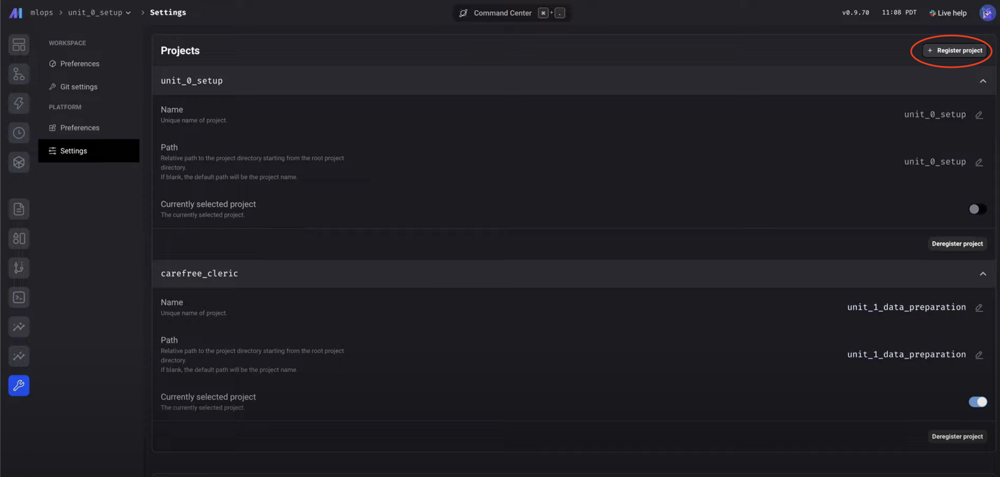

#### 3.1.1.3 Create your first pipeline (Data Preparation)

Pipelines are comprised of modular "blocks" which depending on your pipeline design can run sequentially, conditionally, and/or in parallel. 
##### What exactly are blocks?
`Blocks` are the components of each pipeline that you create. Some example uses would be...
* `Data Ingestion`: These allow you to ingest data from various sources such as databases, APIs, files, etc.
* `Data Transformation/Preparation`: Transformer blocks allow you to perform transformations on the ingested data. You can do this in several different languages based on your requirements.
* `Dynamic Execution`: These allow you to dynamically create and execute multiple downstream blocks at runtime based on the results from upstream blocks. This enables parallel processing and conditional execution of paths within your pipeline.
* `Modularisation`: Modular design is helpful when pipelines need to be changed, editted or evaluated. This improves code organisation, maintainability and reusability across different pipelines.

Overall there 8 types of [blocks](https://docs.mage.ai/design/blocks): Data Loaders, Transformers, Data Exporters, Scratchpads, Sensors, dbt, Extensions, and Callbacks. You can read more about them in the [documentation](https://docs.mage.ai/design/blocks)

#### Creating a pipeline (Data Preparation)
Select the pipeline option on the left hand side ribbon then select `+ New` which should give you the options seen in the screenshot below. In this example chose the `Standard (batch)` option.

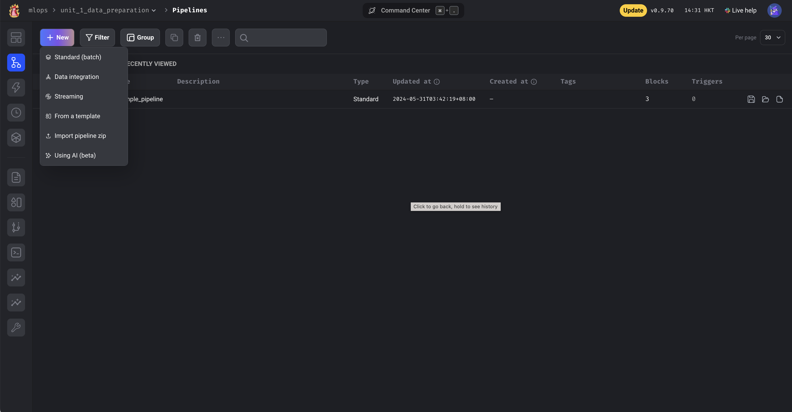

This will then produce a modal that will allow you to tweak the names, and description of the pipeline

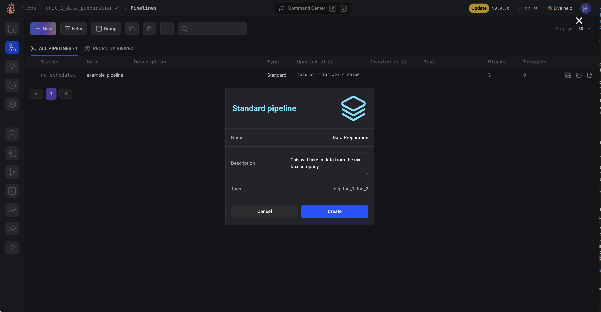

##### Types of pipelines
In this course (so far) we are just using the standard pipeline, but there are several others which I'll document here. There's also a really good summary by Control Automation [here](https://control.com/technical-articles/data-flow-tutorial-with-mage.ai-part-2-initializing-the-software/).
1. **Standard (batch)**: This type of pipeline is used for the processing of data. The data is accumulated at the source and then moved or uploaded to the destination in batches or at once either manually or at scheduled intervals
2. **Data Integration**: THe synchronisation of the data source system with another system. They enable integration and replication of data across different platforms or databases.
3. **Streaming**: Streaming pipelines are used for integrating with or subscribing to publish/subscribe systems like Apache Kafka, Azure Event Hubs, Google Cloud Pub/Sub, etc. They allow processing and analyzing data in real-time as it streams in from these platforms.
4. **From a template**: Use an existing pipeline as a template.
5. **Import pipeline.zip**: The zipfile should include the pipeline's metadata.yaml file and each of the block's script files in the root folder.
6. **Using AI(beta)**: This currently (as of 4/6/2024, dd/mm/yyyy) requires you to have an API key for OpenAI but can be set up relatively easily. [Manikandan Bellan](https://medium.com/@mani.bellan) has a simple description on how to set it up [here](https://medium.com/@mani.bellan/building-a-mage-pipeline-using-ai-a8bf077bbed5).

### 3.1.2 Data Preparation: Ingest Data
#### 3.1.2.1 Create your ingestion block. 
To create any new block, navigate to the `edit pipeline` (`<>`) section. Then in the main pane's ribbon select "All blocks --> Data loader --> Base template (generic). 

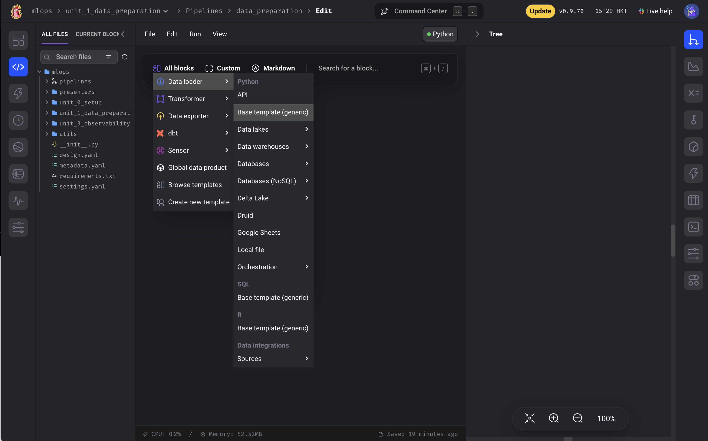

In the pop up modal you will be prompted to enter in names, languages, etc. I went for the following options.
* **Name**: `Ingestion`
* **Type**: `Data loader`
* **Language**: `Python`

Then I clicked "Save and add".

A code block should appear in the main pane. There should be two decorated functions `load_data` and `test_output` these will serve as the functions to load data and provide unit tests.

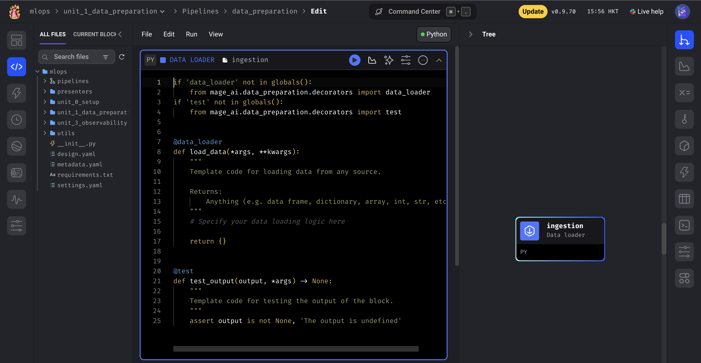

In this case I edited the `load_data` function to download the nyc_taxi_data and import it into a concatenated dataframe.

```
if 'data_loader' not in globals():
    from mage_ai.data_preparation.decorators import data_loader

import pandas as pd
import requests
from io import BytesIO 
from typing import List

@data_loader
def load_data(**kwargs) -> pd.DataFrame:
    """
    Template code for loading data from any source.

    Returns:
        Anything (e.g. data frame, dictionary, array, int, str, etc.)
    """
    dfs : List[pd.DataFrame] = []

    for year, months in [(2024, (1,3))]: #limited to the first two months of 2024
        for i in range(*months):
            url_address = 'https://d37ci6vzurychx.cloudfront.net/trip-data/green_tripdata_'f'{year}-{i:02d}.parquet'
            response = requests.get(url_address)
            if response.status_code != 200:
                raise Exception(response.text) #Display the request's error code if it doesn't work
            df = pd.read_parquet(BytesIO(response.content))
            dfs.append(df)

    return pd.concat(dfs)
```
Some helpful notes for things you may be unfamiliar with...
* `BytesIO` is used to create an in-memory stream of bytes which can be treated like an object, saving memory usage on temporary files.
* `List` from `typing` is needed to specify that a variable or a function parameter/return value should be a list of a particular type.
* `-> pd.DataFrame` the -> is a "hint" and specifies the return type, in this case a pandas DataFrame

You can debug the code bug in the same way as a Jupyter Notebook cell. 
* cmd/cntrl + enter will run the cell/block.
* shift + enter will run the cell/block and suggest to create a new block

NB Later on we will do some unit tests. I will explain then how to do this. But I suggest that at every step we should do this.

#### 3.1.2.2 Creating Charts
If you click on the chart icon in the ribbon on the code pane you should be able to create simple descriptive charts.

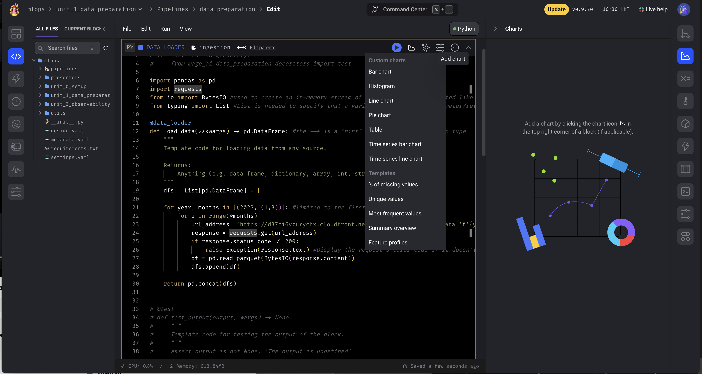

However, be warned I found the whole experience to be rather buggy. 
* There is an issue with understanding datetime formats etc. for time-series charts datetime fields need to be converted to seconds
`df['lpep_pickup_datetime_cleaned'] = df['lpep_pickup_datetime'].astype(np.int64) // 10**9`
* The code for the chart will also appear blank for time-series charts but not others.

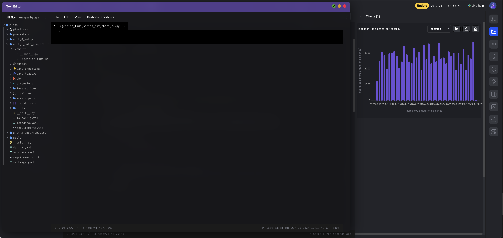

* Furthermore if you use the codeblock above but for 2023, there will be an error. It seems as if there are some errors with the 2023 dataset.

### 3.1.3 Data Preparation: Utilities
Creating utility functions:
For a description of utility functions see [What are utility functions in Python](cohorts/2024/03-orchestration/UtilityFunctions.md)

1. In the text editor create a file/new folder
If you need to create a new folder as well you can simply enter the file path as the filename. e.g. `utils/data_preparation/cleaning.py` for our cleaning utility functions.

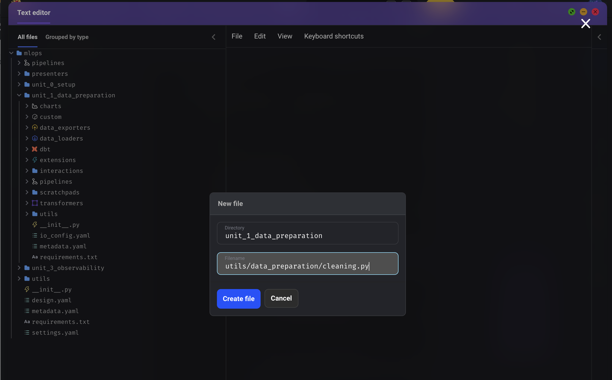.

2. Create Here you can just copy and paste your pre-written functions and/or create new ones.

For example here's some code to calculate durations, and remove extreme outliers

```
import pandas as pd


def clean(
    df: pd.DataFrame,
    include_extreme_durations: bool = False,
) -> pd.DataFrame:

    # Calculate the trip duration in minutes
    df['duration'] = df.lpep_dropoff_datetime - df.lpep_pickup_datetime
    df.duration = df.duration.apply(lambda td: td.total_seconds() / 60)

    if not include_extreme_durations:
        # Filter out trips that are less than 1 minute or more than 60 minutes
        df = df[(df.duration >= 1) & (df.duration <= 60)]

    # Convert location IDs to string to treat them as categorical features
    categorical = ['PULocationID', 'DOLocationID']
    df[categorical] = df[categorical].astype(str)

    return df
```
You can also create utils for `feature engineering.py`, `feature_selection.py`, and for splitting data (`splitters.py`).


NB Just don't forget to add your `__init__.py` file in the directory.

### 3.1.4 Data Preparation: Prepare
Now we can move onto our next block of data preparation which is where we'll import the files, split on values etc.

#### 3.1.4.1 Create a New block
This can be created in a similar way to the first data loader block. See [How to create a block](#-3.1.2.1-Create-your-ingestion-block.).

For this preparation block I selected the Transformer style and used the base template.

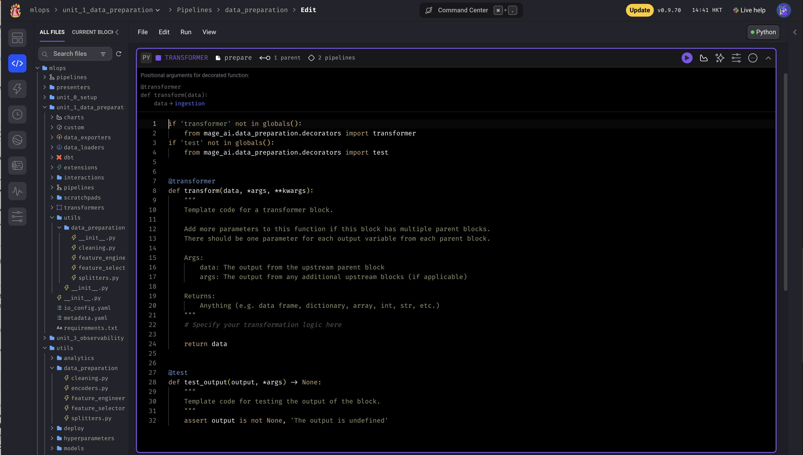

We can then replace it with the code block below
```
from typing import Tuple
import pandas as pd

from mlops.unit_1_data_preparation.utils.data_preparation.cleaning import clean
from mlops.unit_1_data_preparation.utils.data_preparation.feature_engineering import combine_features
from mlops.unit_1_data_preparation.utils.data_preparation.feature_selector import select_features
from mlops.unit_1_data_preparation.utils.data_preparation.splitters import split_on_value

if 'transformer' not in globals():
    from mage_ai.data_preparation.decorators import transformer
if 'test' not in globals():
    from mage_ai.data_preparation.decorators import test

@transformer
def transform(
    df: pd.DataFrame, **kwargs
) -> Tuple[pd.DataFrame, pd.DataFrame, pd.DataFrame]:
    """
    This function recieves the dataframe of nyc green taxi rides then splits it into three dataframes.

    Args:
        df: The initial pandas data frame to load
        kwargs: 'split_on_feature' = The feature to split on
                'split_on_feature_value' = The feature value to split on
                'target' = The feature to use as the model target

    Returns:
        Tuple of Three dataframes
        df1 = a cleaned full dataframe
        df2 = a dataframe for training
        df3 = a dataframe for validation
    """
    split_on_feature = kwargs.get('split_on_feature','lpep_pickup_datetime')
    split_on_feature_value = kwargs.get('split_on_feature_value','2-24-02-01')
    target = kwargs.get('target','duration')

    df = clean(df)
    df = combine_features(df)
    df = select_features(df,features=[split_on_feature, target])

    df_train, df_val = split_on_value(df,
        split_on_feature,
        split_on_feature_value,
        )

    return df, df_train, df_val
```

#### 3.1.4.2 Setting Global Variables
Global variables can be really useful for introducing standardisation. For example in the code block above we really do not want to change the `split_on_feature` and `split_on_feature_value` variables. These can be stored globally so that they will remain standard unless specified by the code.

But why should you bother with global variables?

* **Global variables help share configurations**:
As just stated global variables can be used to store configuration settings that need to be accessed across multiple pipeline steps. For example, API keys, database connection details, etc.
* **Global variables can act as intermediate data storage**: Global variables can act as a way to pass data between different steps in a pipeline. For example a variable generated in one block of code can be stored as a global variable and so used in another.
* **Global variables persist across runs**: Global variables can increase stability between different pipeline runs, or if you need to start a pipeline off from an intermediate step.
* **Global variables make debugging easier**: Having access to global variables makes it easier to inspect and understand the state of a pipeline during development and debugging.

However there are some points of caution...
* **But don't overuse global variables**: Having too many global variables can get confusing and introduce a lot of complexity. Especially if you are programatically defining them during your pipeline. For example, your pipeline may no longer function because your global variable is required at two different states for two parts of your pipeline
* **Provide clear documentation**: Clearly naming and documenting the global variables is key to being able to debug later for either yourself or another person.
* **Make sure your global variables are initialised and updated correctly**: Otherwise your pipeline may fail and you'll spend an eternity trying to undo the mess. Particularly if they are in a chain.
* **Consider a `Settings` file instead**: If certain variables are pretty much immutable. It will probably be better to store and read them from a configs or settings file rather than rely on a global variable.

##### Creating a global variable
Global variables can be created relatively simply by selecting the the `variable` (x = ) button from the right hand side pane. From here you can create any variables and specify whichever variables you prefer. 


In this walk through we created the following global variables

| Global Variable | Value |
|-----------------|-------|
|split_on_feature| 'lpep_pickup_datetime'|
|split_on_feature_value|'2024-02-01'|
|target|'duration'|

If you now run both the loaded and the transformer you should see the output results at the bottom of the cell.

Now your data should be prepared and ready to run through the model.

### 3.1.5 Data Preparation: Prepare Chart
However, if you want to check aspects such as how skewed the data is you can easily just click on the chart icon and produce a histogram to view the distribution of duration values.

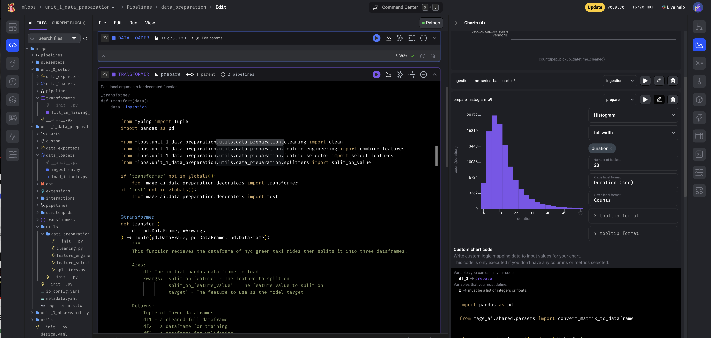

In this case we can see a large skew of short taxi rides.

### 3.1.6 Data Preparation: Build Encoders
The next block is to encode the data. Specifically our categorical column (`PU_DO`). As it is purely categorical and not ordinal we can either use the [OneHotEncoder](https://scikit-learn.org/stable/modules/generated/sklearn.preprocessing.OneHotEncoder.html) or the [DictVectorizer](https://scikit-learn.org/stable/modules/generated/sklearn.feature_extraction.DictVectorizer.html#dictvectorizer).

As explained earlier in the [Preparation block](#-3.1.3-Data-Preparation:-Utilities), the best option here is to create an encoding utility script and access it there.

The encoding script should look similar to this below
```
from typing import Dict, List, Optional, Tuple

import pandas as pd
import scipy
from sklearn.feature_extraction import DictVectorizer


def vectorize_features(
    training_set: pd.DataFrame,
    validation_set: Optional[pd.DataFrame] = None,
) -> Tuple[scipy.sparse.csr_matrix, scipy.sparse.csr_matrix, DictVectorizer]:
    dv = DictVectorizer()

    train_dicts = training_set.to_dict(orient='records')
    X_train = dv.fit_transform(train_dicts)

    X_val = None
    if validation_set is not None:
        val_dicts = validation_set[training_set.columns].to_dict(orient='records')
        X_val = dv.transform(val_dicts)

    return X_train, X_val, dv
```
### 3.1.7 Data Preparation: The Build block
Now we're in a position to finalise the dataframe for training. So we now create another block but this time we want a `data_exporter` block as this will be the final step for the data preparation pipeline. The plan in this block is to return the X_train, X_val, y_train, and y_val variables that will be needed to train the model. This can be seen here
```
from typing import Tuple
from pandas import DataFrame, Series
from scipy.sparse._csr import csr_matrix
from sklearn.base import BaseEstimator

from mlops.unit_1_data_preparation.utils.data_preparation.encoders import vectorize_features
from mlops.unit_1_data_preparation.utils.data_preparation.feature_selector import select_features

if 'data_exporter' not in globals():
    from mage_ai.data_preparation.decorators import data_exporter
if 'test' not in globals():
    from mage_ai.data_preparation.decorators import test


@data_exporter
def export_data(
    data: Tuple[DataFrame, DataFrame, DataFrame], *args, **kwargs) ->Tuple[
        csr_matrix,
        csr_matrix,
        csr_matrix,
        Series,
        Series,
        Series,
        BaseEstimator]:
    """
    Exports data to from dataframes into matrices for features, pd.Series for the target values, and a BaseEstimator for the dictionary vectoriser.

    Args:
        data: The output from the upstream parent block, i.e. the three dataframes (df, df_train, and df_val)
        args: The output from any additional upstream blocks (if applicable) - I believe these should be specified as the global variables

    Output (optional):
        X: The combined matrix of X values (both train and val)
        X_test: The matrix of X_train values
        X_val: The combined matrix of X_val values
        y: The series of y values (both train and val)
        y_train: The y values for the train dataframe
        y_val: The y values for the validation dataframe
    """
    df, df_train, df_val = data
    target = kwargs.get('target','duration')

    X, _, _ = vectorize_features(select_features(df))
    y: Series = df[target]

    X_train, X_val, dv = vectorize_features(
        select_features(df_train),
        select_features(df_val)
    )
    y_train = df_train[target]
    y_val = df_val[target]

    return X, X_train, X_val, y, y_train, y_val, dv
```
### 3.1.8 Data Preparation: Build Test
However, before we complete the build we should check to confirm that the outputs are as expected. These are known as **Unit Tests** and dataquest has a nice overview [here](https://www.dataquest.io/blog/unit-tests-python/).

In this case here, we are going to perform a relatively simple test for the whole dataset, the train, and the validation set. Where we check to make sure that
1. There are the correct number of entries in X
2. There are the correct number of columns in X
3. The number of entries in X and y are equal.

NB It is worth noting that in this cases the number of columns differ between the whole dataset, and those in X_train, and X_val. This is because a different dictionary vectorizer is used for the two. The whole dataset will contain more combinations than the `X_train` and `X_val` ones where the DictVectorizer is only encoded on the `X_train` data.

To do this we can simply add this code on the bottom of the exporter block. Don't forget the `@test` decorator though!
```
@test
def test_dataset(
    X: csr_matrix,
    X_train: csr_matrix,
    X_val: csr_matrix,
    y: Series,
    y_train: Series,
    y_val: Series,
    *args,
) -> None:
    assert (
        X.shape[0] == 105870
    ), f'Entire dataset should have 105,870 examples, but it has {X.shape[0]}'
    assert(
        X.shape[1] == 7027
    ), f'Entire dataset should have 7,027 features, but it has {X.shape[1]}'
    assert(
        len(y.index) == X.shape[0]
    ), f'There are not the same number of y examples and X examples, there are {len(y.index)} y values and {X.shape[0]} X values'

def test_training_set(
    X: csr_matrix,
    X_train: csr_matrix,
    X_val: csr_matrix,
    y: Series,
    y_train: Series,
    y_val: Series,
    *args,
) -> None:
    assert (
        X_train.shape[0] == 54378
    ), f'X_train should have 105,870 examples, but it has {X_train.shape[0]}'
    assert(
        X_train.shape[1] == 5094
    ), f'X_train should have 7,027 features, but it has {X_train.shape[1]}'
    assert(
        len(y_train.index) == X_train.shape[0]
    ), f'There are not the same number of y_train examples and X_train examples, there are {len(y_train.index)} y_train values and {X_train.shape[0]} X_train values'

def test_validation_set(
    X: csr_matrix,
    X_train: csr_matrix,
    X_val: csr_matrix,
    y: Series,
    y_train: Series,
    y_val: Series,
    *args,
) -> None:
    assert (
        X_val.shape[0] == 51492
    ), f'X_val should have 51,492 examples, but it has {X_val.shape[0]}'
    assert(
        X_val.shape[1] == 5094
    ), f'X_val should have 5,094 features, but it has {X_val.shape[1]}'
    assert(
        len(y_val.index) == X_val.shape[0]
    ), f'There are not the same number of y_val examples and X_val examples, there are {len(y_val.index)} y_val values and {X_val.shape[0]} X_val values'


```

## 3.2 Training: sklearn models and XGBoost
## 3.3 Observability: Monitoring and Alerting
## 3.4 Triggering: Inference and Retraining
## 3.5 Deploying: RUnning Operations in Production